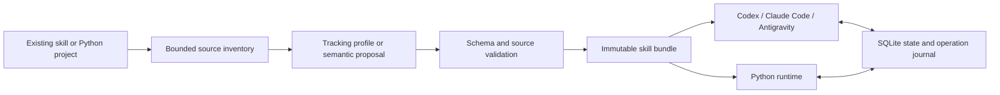

# skillstate-kit

**Portable, validated execution state for agent skills.**

Turn an existing `SKILL.md` into a state-backed skill, use it from Codex, Claude Code or Antigravity, and resume work from a durable checkpoint. Embed the same runtime in Python when you need to control every model input and tool operation.

[](https://github.com/Atakan-Emre/skillstate-kit/actions/workflows/ci.yml)


**Release status:** `0.1.1` is an initial alpha. The development repository is private; public package installation uses PyPI. Tested local adapters are not live certification of every host application.

[Türkçe başlangıç](docs/README_TR.md) · [CLI](docs/cli.md) · [Architecture](docs/architecture.md) · [Compatibility](docs/compatibility.md) · [Validation](docs/validation.md)

## What you get

- **Source-preserving conversion.** Generate bounded tracking state without changing the original procedure.
- **Semantic generation.** Use your coding agent or a configured JSON-capable model endpoint to propose domain-specific state. Validate proposals against source fingerprints before applying them.
- **Durable state.** SQLite transactions, revision checks, ownership handoff and a persistent operation journal.
- **Controlled execution.** Validate state and tool arguments, retain observations during retries, and stop ambiguous operations from being replayed automatically.
- **Three host adapters.** Project-scoped skills and optional STDIO MCP configuration for Codex, Claude Code and Antigravity.
- **A Python SDK.** Bring your own model and tool functions. The core package requires no API key.

## Quick start

```bash
python -m pip install "skillstate-kit[mcp,http]"
skillstate demo
```

Then, inside your target project (replace `skills/qa/SKILL.md` with your skill):

```bash

skillstate init --host codex --host claude-code --host antigravity --mcp
skillstate generate skills/qa/SKILL.md --name qa-state --install
skillstate validate qa-state
skillstate doctor --mcp
```

After installing the package, run `init` and `generate` in your target project. `--project PATH` can also be placed **before** a subcommand. Generated MCP configurations use this machine's Python/project paths; keep them local. See [installation and compatibility](docs/compatibility.md).

After the host discovers `generate-skill-state`, ask:

> Generate skill state from my existing QA skill and install it in this project.

The generator skill can prepare a source inventory, propose domain-specific state, then submit the proposal for deterministic validation. A standalone terminal process cannot silently borrow the host's model session or subscription.

### Try it without a model account

```bash
skillstate demo
```

The demo explicitly uses a **scripted model** and local tools. It completes five operations and reports prompt sizes in UTF-8 **bytes**, not tokens. It is an executable example, not a reproduction of the paper's benchmarks.

## Two execution modes

| Mode | Model and tools run in | What the package controls |
|---|---|---|
| Native skill | Your coding agent | Validated state, checkpoints, explicit operation records, bounded returned context |
| Managed runtime | Your Python application | Model context, decision validation, registered tools, retries and operation outcomes |

Native skills do **not** replace the host's conversation history or intercept every native tool. For the paper's history-free model-input structure, use the managed runtime with a stateless model adapter. Instructions, state, tool schemas and observations must fit their configured budgets.

## Python integration

```python
from skillstate import Skill, SkillRuntime, SQLiteStore, Tool, ToolResult

skill = Skill(
    name="record-job",
    instructions="Record the requested job. Finish after its result is confirmed.",
    state_schema={
        "type": "object",
        "properties": {"recorded": {"type": "boolean"}},
        "required": ["recorded"],
        "additionalProperties": False,
    },
    initial_state={"recorded": False},
)

def record(arguments, operation_id):
    # Replace with your service call. Forward operation_id to its idempotency
    # facility if supported, and inspect the actual result before success.
    return ToolResult(True, {"recorded": True})

tool = Tool("record", "Record a job",
            {"type": "object", "additionalProperties": False}, record)

async def run(model):
    with SQLiteStore("jobs.sqlite3") as store:
        store.create("job-001", skill, "worker", {"job": "example"})
        runtime = SkillRuntime(store, model, [tool],
                              completion_check=lambda s: s["recorded"] is True)
        return await runtime.run("job-001", "worker", max_steps=10)
```

Pass your synchronous or asynchronous model callback to `run`. See [the complete runnable example](examples/managed_runtime.py). A repeated `create` rejects an existing run; resume by opening the same database and calling `runtime.run` on its existing ID.

### Decision contract

```json
{
  "patch": [{"op": "set", "path": "/recorded", "value": true}],
  "action": {"name": "record", "arguments": {}},
  "done": false
}
```

Use `{"patch": [], "action": null, "done": true}` to finish. Explicit `set`/`delete` operations use JSON Pointer paths. Setting `null` does not delete a key. No reasoning-trace field is accepted.

## How generation works



Default conversion preserves the procedure and adds generic bounded progress state. It does **not** infer every business invariant. Semantic proposals can supply domain-specific fields and steps; structural validation still needs to be followed by application tests.

Definitions live under `.skillstate/definitions/`. Run data and artifacts live under `.skillstate/local/`. Original files remain unchanged. Source changes are detected before new runs; existing runs retain their pinned definition and expose drift.

## Failure behavior

| Event | Behavior |
|---|---|
| Invalid JSON, state or tool arguments | Reject before tool execution |
| Stale revision or wrong owner | Reject; require a fresh read/handoff |
| Tool reports failure | Keep prior state and record its observation |
| Timeout, exception or invalid tool result | Mark `unknown`; require reconciliation |
| Process exits after reserving an operation | Retain the pending intent; do not replay automatically |
| Event write fails during result commit | Roll back state, operation outcome and event together |
| User edits installed files/configuration | Preserve changes and report a conflict |

SQLite does not create a distributed transaction with external APIs. A checkpoint cannot undo an external side effect. Owner IDs coordinate local clients; they are not an authentication boundary. Read [the execution contract](docs/architecture.md) before using mutating tools.

## Development

```bash
python -m pip install uv
uv sync --locked --extra dev
uv run ruff check src tests examples
uv run ruff format --check src tests examples
uv run pytest --cov=skillstate --cov-fail-under=85
uv run python -m build
uv run twine check dist/*
```

CI tests the Python/OS matrix, builds distributions and checks wheel installation. Tests include real MCP sessions, competing connections, crash recovery, configuration preservation, invalid schemas and source drift. Coverage is a regression signal, not proof of correctness.

## Research and attribution

An **independent implementation** inspired by [SKILL.state: Scalable Long-Horizon Agent Skills](https://arxiv.org/abs/2608.26263), by Sanket Badhe, Priyanka Tiwari and Jonghyun Chung. Not affiliated with or endorsed by the authors or their institutions.

The managed runtime follows the explicit-state input pattern. Our compiler, host adapters, explicit patch format and operation journal are engineering extensions. No paper benchmark scores are claimed. [skill-state-minimal](https://github.com/kissishka/skill-state-minimal) was inspected as a comparison; its source is not bundled here.

## License and contributing

[MIT](LICENSE). See [CONTRIBUTING.md](CONTRIBUTING.md), [SECURITY.md](SECURITY.md), [CHANGELOG.md](CHANGELOG.md) and [release guidance](docs/releasing.md).
