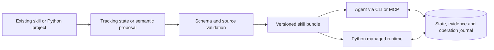

<p align="center">
  
</p>

<p align="center">
  <a href="https://pypi.org/project/skillstate-kit/"></a>
  
  <a href="LICENSE"></a>
  
</p>

<p align="center">
  <a href="https://pypi.org/project/skillstate-kit/">PyPI</a> ·
  <a href="#quick-start">Quick start</a> ·
  <a href="#python-integration">Python example</a> ·
  <a href="docs/README_TR.md">Türkçe</a> ·
  <a href="docs/host-acceptance.md">Verified integrations</a>
</p>

# skillstate-kit

**A portable, validated execution-state layer for long-running AI agents.**

Keep task progress, observations, artifacts and operation state outside conversational history. Use your existing agent through project skills, CLI or MCP, or embed the canonical runtime in Python. Task-specific semantic state remains supported; no custom Python agent is required for host integration.

By reducing redundant work and providing bounded application state, skillstate-kit is designed to improve long-horizon execution efficiency. Provider-level token, latency and cost effects depend on the host and require separate measurement.

**Version [0.2.0 is available on PyPI](https://pypi.org/project/skillstate-kit/0.2.0/), open source under the [MIT license](LICENSE).** The project is in alpha. Install the package from PyPI or explore and contribute to this repository.

**External-project validation:** the existing Hugging Face smolagents SQL agent
produced the same five correct results on 1,000 synthetic receipts before and
after integration. The managed run resumed in a new process after an injected
interruption, without repeating completed queries.
[Read the experiment and its scope](docs/smolagents-acceptance.md).

**Coding-agent measurement:** four fresh Codex sessions completed the same persisted
task and passed 29 independent checks. This small paired trial used **more**, not
fewer, tokens and wall time with SkillState. [Read the measured results and
limitations](docs/benchmarks/coding-agent.md) before making performance claims.

## Why skillstate-kit?

| Capability | What it gives you |
|---|---|
| Source-preserving generation | Keep your instructions and add structured progress tracking. |
| Domain-specific state | Let your agent propose fields and steps, then validate the proposal against the source. |
| Durable checkpoints | SQLite transactions, revision checks, evidence artifacts and explicit ownership handoff. |
| Controlled operations | Validate decisions before execution and retain uncertain outcomes for reconciliation. |
| Python, CLI and MCP | Use one state engine across application code and supported agent integrations. |

## Quick start

### 1. Install

Use Python **3.11 or newer**, preferably in your project's virtual environment:

```bash
python -m pip install "skillstate-kit[mcp]"
skillstate init
skillstate doctor --mcp
```

Run setup inside your target project. `init` detects supported project hosts, installs lifecycle/generator skills and preserves unrelated instructions/configuration. Reload host discovery, then work normally—for example: **“Implement duration parsing for this project.”** The integration guides your agent to inspect existing runs, record evidence-backed milestones and validate completion.

The base `pip install skillstate-kit` also works with `skillstate init` through CLI instructions. MCP is optional. `skillstate demo` remains an explicitly scripted offline example. See [host setup and distribution](docs/integrations.md) and [execution state versus chat history](docs/execution-state.md).

For Python-only use, install `skillstate-kit`. Add the `http` extra when you need a configured JSON-compatible model endpoint: `python -m pip install "skillstate-kit[mcp,http]"`.

### 2. Convert your existing skill

Run these commands **inside the project you want to integrate**. Replace `skills/qa/SKILL.md` with your existing skill file:

```bash
skillstate init --host codex --mcp
skillstate generate skills/qa/SKILL.md --name qa-state --install
skillstate validate qa-state
skillstate doctor --mcp
```

`init` sets up the selected host; `generate --install` writes the generated skill wrappers for the three project adapters. Original source files remain unchanged. To target another directory, place `--project PATH` before the subcommand.

**No existing skill file?** In a Python project, start with the built-in test workflow:

```bash
skillstate generate . --profile python-tests --name tests-state --install
skillstate validate tests-state
```

This produces test-oriented tracking instructions from a bounded project inventory. It does not infer every business rule in your application.

### 3. Ask your agent to use it

After your host discovers the installed skills and MCP server, ask:

> Use qa-state for this task. Open a run, record progress and evidence, and leave a checkpoint if the work is interrupted.

For agent-assisted **domain-specific generation**, use the installed `generate-skill-state` skill:

> Generate skill state from skills/qa/SKILL.md. Propose the fields and steps this procedure needs, validate the proposal, and install the result.

Direct CLI generation creates generic tracking state. Agent-assisted generation can propose domain-specific state. **Generating a definition does not execute the task.** The host still runs the procedure and records its progress.

## Choose your environment

Use `skillstate hosts detect` to inspect discovery evidence and `skillstate doctor codex` or `skillstate doctor claude-code` for focused checks. Detection is not a live execution test. Project instruction blocks encourage automatic lifecycle use; host/model selection and permissions still apply.

| Environment | Setup inside your project | Verified scope |
|---|---|---|
| Codex | `skillstate init --host codex --mcp` | Real MCP generation and continuation across two model sessions passed. |
| Claude Desktop **Chat** | `skillstate connect claude-desktop` | Codex → Claude Desktop handoff and independent invoice review passed. |
| Claude Code | `skillstate init --host claude-code --mcp` | Adapter available; a live Claude Code run has not been verified. |
| Antigravity | `skillstate init --host antigravity --mcp` | Project skill and MCP configuration adapter available. |

For Claude Desktop, **fully quit and reopen the app after connecting**, use Chat, and approve the requested tools in the app. This connection is separate from Claude Code and Cowork. Run `skillstate disconnect claude-desktop` to remove the connection while retaining run data.

MCP configurations contain this machine's Python and project paths. Keep them local and repeat setup when changing machines or virtual environments. `doctor --mcp` checks the local server; it does not prove that a host's model can call it.

See the [installation guide](docs/compatibility.md), [actual acceptance evidence](docs/host-acceptance.md), and [repeatable two-reviewer exercise](examples/desktop_acceptance/README.md).

## Evidence-backed task lifecycle

For a normal multi-step task, the agent can use `task_start`, `task_checkpoint` and `task_complete`. Identical goal/plan startup reuses its deterministic run ID; an intentionally new task can supply a new ID. A checkpoint references real artifacts and relevant resource fingerprints. Repeating a completed milestone requires a stated revalidation reason. Completion checks evidence integrity, remaining work, blockers and freshness—not the truth of arbitrary business claims.

Existing semantic skills retain `run_open`/`run_update` and their own domain schema. All paths share one SQLite store and the existing pending/unknown operation protocol. See the [CLI reference](docs/cli.md).

## Inspect a checkpoint

Open a run for a generated definition, then inspect its state and audit trail:

```bash
skillstate run open qa-state --owner codex --id qa-001
skillstate run context qa-001
skillstate run events qa-001
skillstate status
```

These commands create and inspect a run; they do not execute its steps. Use a new run ID for each task. To continue an existing task, read its context and resume that run rather than opening it again. Ownership changes use an explicit handoff with the current revision; see the [CLI lifecycle guide](docs/cli.md).

## Python integration

Save the following as `example.py`, then run `python example.py`. This complete example uses a **scripted model and a simulated tool**, so it works without credentials:

```python
import asyncio

from skillstate import Skill, SkillRuntime, SQLiteStore, Tool, ToolResult

async def main():
    skill = Skill(
        "record-job",
        "Record the job; finish after its result is confirmed.",
        {
            "type": "object",
            "properties": {"recorded": {"type": "boolean"}},
            "required": ["recorded"],
            "additionalProperties": False,
        },
        {"recorded": False},
    )

    def model(context):
        if context["state"]["recorded"]:
            return {"patch": [], "action": None, "done": True}
        return {
            "patch": [{"op": "set", "path": "/recorded", "value": True}],
            "action": {"name": "record", "arguments": {}},
            "done": False,
        }

    def record(arguments, operation_id):
        return ToolResult(True, {"recorded": True, "operation_id": operation_id})

    tool = Tool("record", "Record a job", {"type": "object", "additionalProperties": False}, record)
    with SQLiteStore() as store:
        store.create("example", skill, "worker", {"job": "example"})
        runtime = SkillRuntime(store, model, [tool], completion_check=lambda s: s["recorded"])
        result = await runtime.run("example", "worker")
        print(result["status"], result["state"])

if __name__ == "__main__":
    asyncio.run(main())
```

Expected output:

```text
completed {'recorded': True}
```

Replace `model(context)` with your synchronous or asynchronous model callback, and `record` with a real tool that checks its result. Forward `operation_id` to the external service's idempotency facility when supported.

The example uses an in-memory store for easy reruns. Use `SQLiteStore("jobs.sqlite3")` for durable storage. Create each run once; resume by reopening that database and calling `runtime.run` with the existing run ID and owner. See the [runnable source](examples/managed_runtime.py) and [runtime contract](docs/architecture.md).

### Model decision contract

```json
{
  "patch": [{"op": "set", "path": "/recorded", "value": true}],
  "action": {"name": "record", "arguments": {}},
  "done": false
}
```

Finish with `{"patch": [], "action": null, "done": true}`. State updates use explicit `set`/`delete` operations and JSON Pointer paths. Setting `null` does not delete a key. No reasoning-trace field is accepted.

## How it fits together



| Execution mode | What skillstate-kit controls |
|---|---|
| Native agent integration | Validated state, checkpoints, explicit operation records and bounded returned context. The host owns its model and tools. |
| Python managed runtime | Model context, decision validation, registered tool execution, retries and recorded outcomes. |

Native integrations do not replace a host's conversation history or intercept every native tool. For the paper's history-free model-input pattern, use the managed runtime with a stateless model adapter. A terminal process cannot borrow your IDE's model subscription automatically.

Definitions live in `.skillstate/definitions/`; private run data and artifacts live in `.skillstate/local/`. Source changes are detected before new runs. Existing runs retain their pinned definition and expose source drift.

## Failure behavior

| Event | Behavior |
|---|---|
| Invalid JSON, state or tool arguments | Reject before tool execution |
| Stale revision or wrong owner | Reject; require a fresh read/handoff |
| Tool reports failure | Keep prior state and record its observation |
| Timeout, exception or invalid tool result | Mark `unknown`; require reconciliation |
| Process exits after reserving an operation | Retain the pending intent; do not replay automatically |
| Event write fails during result commit | Roll back state, operation outcome and event together |
| User edits installed files/configuration | Preserve changes and report a conflict |

SQLite does not create a distributed transaction with external APIs. A checkpoint cannot undo an external side effect. Owner IDs coordinate local clients; they are not an authentication boundary. Read [the execution contract](docs/architecture.md) before using mutating tools.

## Development

```bash
python -m pip install uv
uv sync --locked --extra dev
uv run ruff check src tests examples
uv run ruff format --check src tests examples
uv run pytest --cov=skillstate --cov-fail-under=85
uv run python -m build
uv run twine check dist/*
```

CI tests the Python/OS matrix, builds distributions and checks wheel installation. Tests include real MCP sessions, competing connections, crash recovery, configuration preservation, invalid schemas and source drift. Coverage is a regression signal, not proof of correctness.

## Research and attribution

An **independent implementation** inspired by [SKILL.state: Scalable Long-Horizon Agent Skills](https://arxiv.org/abs/2608.26263), by Sanket Badhe, Priyanka Tiwari and Jonghyun Chung. Not affiliated with or endorsed by the authors or their institutions.

The managed runtime follows the explicit-state input pattern. Our compiler, host adapters, explicit patch format and operation journal are engineering extensions. No paper benchmark scores are claimed. [skill-state-minimal](https://github.com/kissishka/skill-state-minimal) was inspected as a comparison; its source is not bundled here.

## License and contributing

[MIT](LICENSE). See [CONTRIBUTING.md](CONTRIBUTING.md), [SECURITY.md](SECURITY.md), [CHANGELOG.md](CHANGELOG.md) and [release guidance](docs/releasing.md).
