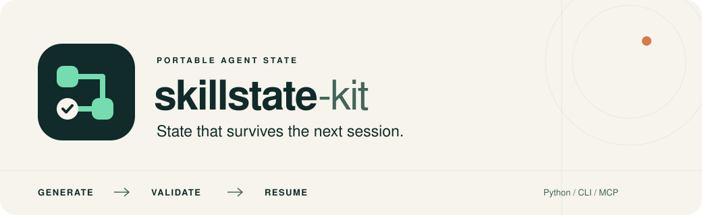

# Türkçe başlangıç

[PyPI paketi](https://pypi.org/project/skillstate-kit/) · [Çalışan Python örneği](../README.md#python-integration) · [Kabul testleri](host-acceptance.md)

skillstate-kit, mevcut agent skill'lerini kalıcı ve doğrulanan görev durumuyla kullanmanızı sağlar. MIT lisansıyla açık kaynak olarak yayımlanır ve PyPI üzerinden kurulabilir. Sürüm alpha durumundadır.

**Dış proje doğrulaması:** Hugging Face smolagents'ın mevcut SQL agent'ı, 1.000 sentetik kayıt üzerindeki beş kontrolde entegrasyon öncesi ve sonrası aynı doğru sonuçları üretti. Skillstate ile çalışan süreç zorla kapatıldıktan sonra yeni süreç kalan iki sorguyla tamamlandı; bitmiş sorgular tekrarlanmadı. [Deneyin kapsamı, sonuçları ve tekrar çalıştırma adımları](smolagents-acceptance.md).

## Kurulum

Python 3.11 veya üzeri bir ortamda:

```text
python -m pip install "skillstate-kit[mcp,http]"
skillstate demo
```

Ardından kullanacağınız projenin klasöründe:

```text
skillstate init --host codex --host claude-code --host antigravity --mcp
skillstate generate skills/qa/SKILL.md --name qa-state --install
skillstate validate qa-state
skillstate doctor --mcp
```

`skills/qa/SKILL.md` yerine kendi dosyanızı kullanın. Yalnızca kullandığınız host'ları seçebilirsiniz. `--mcp` opsiyoneldir; temel kullanım CLI üzerinden çalışır. MCP ayarları bu makineye ait Python/proje yollarını içerir.

## Otomatik üretim

Claude Desktop'ın **Chat** bölümünü kullanıyorsanız ayrıca `skillstate connect claude-desktop` çalıştırıp uygulamadan tamamen çıkın ve yeniden açın. Bu bağlantı Claude Code kurulumundan ayrıdır. Araç izinlerini uygulama içinde siz verirsiniz. `skillstate disconnect claude-desktop` bağlantıyı kaldırır, görev durumunu korur. Windows Store sürümü de desteklenir; birden fazla ayar dosyası bulunursa `--config DOSYA` ile seçilir.

Gerçek uygulama testlerinin sonucu [kabul raporunda](host-acceptance.md), tekrar edilebilir örnek ise [örnek projede](../examples/desktop_acceptance/README.md). Codex'te gerçek MCP üretimi ve ayrı oturumdan devam etme; ayrıca Codex → Claude Desktop Chat devri ve ikinci incelemeyle tamamlama doğrulandı. Claude Code için canlı uygulama testi yapılmadı.

Kurulumdan sonra agent'a “Generate skill state; bu skill'i durum yapısına dönüştür” diyebilirsiniz. Üretici kaynak envanterini hazırlayıp agent'ın önerdiği şemayı doğrular.

Doğrudan `generate`, yönergeleri koruyan sınırlı bir genel ilerleme şeması oluşturur. Alana özel dönüşüm için agent destekli `--prepare`/`--proposal` akışı veya yapılandırılmış `--base-url`/`--model` kullanılır. Terminal, IDE model hesabını otomatik kullanmaz.

## Çalıştırma ve devam

Üretim komutu görevi çalıştırmaz. Agent'a “qa-state skill'ini bu görevde kullan, ilerlemeyi ve kanıtları kaydet” diyerek çalışmayı başlatın. Durumu terminalden incelemek için:

```text
skillstate run open qa-state --owner codex --id qa-001
skillstate run context qa-001
skillstate run events qa-001
skillstate status
```

Her yeni görev için farklı bir run ID kullanın. Var olan göreve devam ederken yeniden açmak yerine mevcut durumu okuyun. Python ile doğrudan kullanım için [kopyalanıp çalıştırılabilen örneğe](../README.md#python-integration) bakın.

Üretilen skill, state açma, okuma, güncelleme, işlem sonucu kaydetme ve ortamlar arasında devretme adımlarını içerir. Python projeleri `SkillRuntime` ile bütün model/araç döngüsünü yönetebilir.

Native skill host'un konuşma geçmişini silmez. Makaledeki geçmiş taşımayan model girdisini kurmak için stateless adapter ile managed runtime kullanın.

`pending` veya `unknown` bir dış işlemin sonucunun belirsiz olduğunu gösterir. Tekrarlamadan önce dış sistemden sonucu kontrol edin ve açıkça uzlaştırın. Checkpoint dış dünyadaki işlemi geri almaz.

## Doğrulama

`skillstate demo` model hesabı gerektirmeyen kontrollü örnektir. `doctor --mcp` gerçek yerel MCP bağlantısı kurar. Bunlar bütün IDE sürümlerinin davranışını veya makalenin performans sonuçlarını doğrulamaz.

Ayrıntılar: [CLI](cli.md), [mimari](architecture.md), [ortam desteği](compatibility.md), [test matrisi](validation.md).
