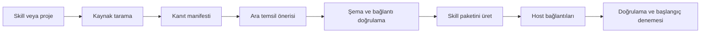

# Skill State: PyPI, otomatik dönüştürme ve çoklu agent ortamı tasarımı

Tarih: 6 Eylül 2026.
Durum: Araştırmaya dayalı ürün ve mühendislik önerisi. Bu dosyadaki komutlar, paket adları ve API'ler henüz uygulanmış veya yayımlanmış değildir.

Bu belge önceki `DESIGN_TR.md` kapsamını genişletir. Önceki belgede sonraya bırakılan otomatik şema üretimi artık ana ürün kapsamındadır. İlk sürümde aynı run için tek aktif yazıcı ilkesi korunur; farklı ortamlar aynı çalışmayı kontrollü biçimde devralabilir.

## 1. Ürün kararı

Amaç: Kullanıcı bir Python paketi kurar; mevcut SKILL.md dosyasını, workflow'unu veya desteklenen proje yapısını state ile devam edebilen bir skill paketine dönüştürür. Oluşan paket Codex, Claude Code ve Antigravity'de kullanılabilir; Python uygulamasına da bağlanabilir.

Önerilen ürün üç parçanın birlikte çalışmasıdır:

1. Skill Compiler: Kaynağı inceler, adımları ve veri sözleşmesini çıkarır, çalıştırılabilirlik seviyesini doğrular, hedef ortama uygun skill üretir.
2. State Runtime: Durum revizyonları, bütçeler, işlemler, checkpoint ve çalışma devrini yönetir.
3. Host Adapters: Skill keşfi, CLI/MCP bağlantısı ve mevcutsa hook olaylarını ortamın desteklediği biçime çevirir.

Kullanıcıya tek kurulum ve basit komutlar gösterilir. İçerideki bu ayrım, yeni ortama destek eklerken state motorunun yeniden yazılmasını önler.

## 2. Üç farklı uyumluluk seviyesi

| Seviye | Ne sağlanır? | Ne garanti edilmez? |
|---|---|---|
| Native skill | Ortam skill'i keşfeder; agent CLI veya MCP ile güncel durumu okur/yazar | Her araç çağrısının yakalanması ve host geçmişinin kaldırılması |
| Hook destekli native | Belgelenmiş olaylardan otomatik checkpoint/sonuç toplama | Bütün sürümlerde aynı olaylar, tam geçmiş kontrolü |
| Managed runtime | Kütüphane model girdisini, araç çağrısını ve kayıt sırasını yönetir | Harici araçla veritabanı arasında genel exactly-once garantisi |

Native mod ürünün ilk kullanıcı deneyimidir. Managed mod Python agent uygulamaları için ayrı çalıştırma biçimidir. Host'a bağlı aracı bir API model çağrısıyla değiştirirsek bunun farklı yürütme ve kimlik doğrulama biçimi olduğu açık olmalı.

Skill veya MCP desteği, host'un konuşma geçmişini değiştirme yetkisi değildir. Native modda ürünün kendi state/context çıktısını sınırlandırabiliriz; bütün IDE oturumunun token maliyetine sabit üst sınır koyamayız. Bu nedenle native paketler için otomatik O(1) toplam prompt vaadi kullanılmamalı.

## 3. PyPI kurulumu ve ilk kullanım

Aşağıdaki `<paket-adi>` yayımlanmadan önce seçilecek gerçek dağıtım adını temsil eder. `skillstate` önerilen CLI adıdır; isim uygunluğu ayrıca kontrol edilecek.

```text
python -m pip install "<paket-adi>"
skillstate init --host codex --host claude-code --host antigravity
```

`pip install` Python paketini kurar. Agent ortamına keşfedilebilir skill veya MCP kaydı eklemek `init` işleminin sorumluluğudur. Paket kurulumunun arka planda bütün kullanıcı IDE ayarlarını değiştirmesi tasarlanmamalı.

`init`, varsayılan olarak mevcut projeye kurulum yapar. İsteğe bağlı `--global` kişisel kapsam içindir. İlgili host kurulu değilse hazırlanan dosyaları ve etkinleştirme adımını bildirir. Kurulu olmayı tespit etmek, entegrasyonun gerçekten aktif olduğuna dair testin yerini tutmaz.

Kurulum sonrasında kullanıcı agent'a şunu yazabilir:

> Generate skill state. Bu projedeki test çalıştırma skill'ini dönüştür ve sonucu aynı ortamda kullanıma hazırla.

Belirsiz doğal dil eşleşmesine ek olarak açık skill çağrısı sunulur. Host adapter'ı desteklenen çağırma biçimini kurulum sonucunda gösterir. Kendi ürünümüzün bütün ortamlarda aynı slash komutunu desteklediği varsayılmaz.

Terminal yolu:

```text
skillstate generate ./skills/qa/SKILL.md
skillstate generate . --profile python-tests
skillstate validate qa-state
skillstate doctor
skillstate status
```

Gelişmiş kullanıcı, generator motorunu ilk yapılandırmada seçebilir. Sonraki `generate` çağrısı aynı yapılandırmayı kullanır.

## 4. Otomatik üretimde modeli kim çağırıyor?

Burada üç ayrı yol gerekir:

| Yol | Nasıl çalışır? | Kullanıcı deneyimi |
|---|---|---|
| Host destekli | Aktif Codex/Claude/Antigravity skill'i kaynak manifestini okur ve ara temsili üretir; CLI/MCP doğrulayıp dosyaları oluşturur | Ayrı API anahtarı gerektirmeden mevcut agent oturumu kullanılır; host limitleri geçerlidir |
| Yapılandırılmış model | Terminal komutu seçilmiş uzak veya yerel model adapter'ını çağırır | Gerçek bağımsız tek komut deneyimi |
| Deterministik profil | Bilinen Python test/şema/workflow biçimleri model olmadan dönüştürülür | Bilinen yapı için otomatik; bilinmeyen semantik için taslak |

Yerel CLI, yalnızca Codex terminalinde çalıştığı için Codex'in modeline doğrudan erişemez. Host destekli akışta model görevini ana agent yapar: `generation_prepare` → kaynak okuma → ara temsil önerisi → `generation_apply` → doğrulama.

Bağımsız terminalde sağlayıcı yok ve bilinen profil de eşleşmiyorsa `generate` kaynakları tarar, taslak üretir ve `needs_semantic_input` sonucu döndürür. Tam dönüşüm tamamlandı diye raporlamaz. İlgili taslak host skill tarafından tamamlanabilir.

Paket, IDE'nin oturum belirteçlerini okuyarak kimlik doğrulaması yapmaz. Aynı kullanıcı aboneliğinin bağımsız API erişimi sağladığı varsayılmaz. Çevrimdışı çalışma, deterministik profillerle veya kullanıcının yapılandırdığı yerel modelle mümkündür.

## 5. Hangi girdiler dönüştürülecek?

| Girdi | Çıkarılabilecek bilgi | Çıkarım sınırı |
|---|---|---|
| SKILL.md ve referansları | Amaç, tetikleyici, adımlar, araçlar, çıktılar | Serbest metindeki örtük iş kuralları aday olarak işaretlenir |
| Python fonksiyonları | İmza, type hint, docstring, giriş/çıkış ilişkisi | Dinamik çağrı ve reflection tam çözülemez |
| Pydantic/dataclass/TypedDict | State alanları ve bilinen tipler | Sadece tip, iş anlamını kanıtlamaz |
| Testler ve CI ayarları | Doğrulama komutları, kabul sinyalleri | Testlerin tam iş kapsamı sunduğu varsayılmaz |
| README/workflow belgeleri | Kullanım sırası ve örnekler | Örnek komut var diye otomatik çalıştırılmaz |
| Agent graph tanımları | Desteklenen adapter'da düğüm ve geçişler | İlk sürümde tüm framework sürümlerinin otomatik yeniden yazılması hedeflenmez |
| JS/TS veya başka dilde proje | Skill/belge ve dosya düzeyinde sarma | Derin AST/anlamsal entegrasyon ilgili parser adapter'ını gerektirir |

İlk sürüm SKILL.md dönüşümü ve Python test profiline odaklanmalı. Diğer projeler için genel görev takip şeması üretilebilir; bu, alanın tam otomatik çözümlendiği anlamına gelmez.

## 6. Dönüştürme hattı



### Tarama

Python kodu varsayılan olarak AST ile okunur; taramak için projeyi import etmek gerekmez. Böylece import yan etkileriyle veritabanı veya ağ çağrısı başlatılmaz. `.gitignore` ve ürünün dışlama dosyası dikkate alınır. Sırlar, sanal ortamlar, derleme çıktıları, büyük ikili dosyalar ve dışarı taşan symlink'ler varsayılan kaynak manifestine alınmaz.

Her kaynak için göreli yol, içerik özeti, dil, ilgili satırlar ve hangi çıkarıma kanıt olduğu tutulur. Monorepo'da paket sınırı belirlenir; aynı adlı skill'ler proje/paket kimliğiyle ayrılır.

### Ara temsil: SkillIR

Modelin doğrudan keyfi dosyalar veya shell komutları üretmesi yerine sürümlü bir ara temsil önermesini tercih ediyorum. Alanlar:

- identity: ad, sürüm, kaynak özeti ve hedef profil;
- intent: amaç, girdiler, tamamlanma koşulları;
- steps: adım kimlikleri ve bağımlılıklar;
- state_fields: tip, başlangıç, büyüklük sınırı, sahiplik ve kanıt;
- tool_bindings: mevcut fonksiyon/script ve argüman sözleşmesi;
- transitions: önkoşullar, gözlem beklentileri, başarısızlık politikası;
- unresolved: otomatik doğrulanamayan bağımlılık ve varsayımlar.

Ara temsil kalıcı run state değildir. SkillIR skill'in nasıl işleyeceğini tanımlar; bir run state o skill'in tek bir çalıştırılmasının hangi aşamada olduğunu gösterir.

### Doğrulama

Ara temsil şeması geçerli mi, kaynak sembolleri var mı, parametre isimleri tutuyor mu, başlangıç durumu şemaya uyuyor mu, çıkış koşulları erişilebilir mi, eksik araç var mı, bütçeler tanımlı mı? Döngüler izinli olabilir ama sınırlı tekrar veya dış bitirme koşulu taşımalıdır.

Sadece koddan çıkarılan bir öneri `inferred`; yapısal olarak kontrol edilen kısım `statically_checked`; çalıştırılmış senaryoyla kanıtlanan kısım `behaviorally_checked` olarak ayrı raporlanır. Tahmini bir yüzdeyle bütün pakete sahte güven puanı verilmez.

### Üretme ve güncelleme

Yalnızca doğrulanmış ara temsil, deterministik şablonlar üzerinden dosyalara çevrilir. Üretilen dosyalar sahiplik manifestiyle izlenir. Aynı kaynak ve aynı SkillIR yeniden uygulandığında gereksiz diff oluşmamalı. Modelin iki ayrı üretimde aynı SkillIR'ı vereceği garanti edilmez.

Kaynak SKILL.md, referanslar ve script yolları korunur. İlk dönüşüm varsayılan olarak `qa-state` gibi ayrı bir skill üretir. Yerinde dönüşüm ayrıca seçilebilmeli; orijinal içerik kaybolmamalı. Mevcut AGENTS.md/CLAUDE.md dosyaları gerekmedikçe değiştirilmez; gerekirse yalnızca ürünün sahip olduğu blok eklenir.

## 7. Oluşan dosyalar

```text
project/
  .skillstate/
    project.json
    definitions/
      qa-state/
        skill.ir.json
        state.schema.json
        initial-state.json
        bindings.json
        source-manifest.json
        generation-report.md
    local/
      state.sqlite3
      artifacts/
      install-record.json
  .agents/skills/qa-state/
    SKILL.md
    references/
  .claude/skills/qa-state/
    SKILL.md
    references/
```

Codex ve Antigravity için ortak keşif dizinine tek uyumlu skill üretilebilir. Claude'a uygun dosya ayrı yayımlanır; bütün ortamlardaki state aynı canonical store'a bağlanır. Windows'ta symlink yetkisine ihtiyaç duymayan, içerik özeti izlenen üretilmiş dosyalar tercih edilir.

Definition ve anonim şema dosyaları sürüm kontrolüne girebilir. Gerçek run durumları, artifacts ve makineye özel kurulum bilgileri varsayılan olarak yereldir. Üretilen kaynak manifestinde sır içerikleri tutulmaz.

SQLite tek doğruluk kaynağıdır. JSON state çıktıları okunabilir export/snapshot'tır; agent bunları elle değiştirerek state'i güncellemez. Tüm yazmalar CLI, Python API veya MCP üzerinden doğrulanır.

## 8. Host adapter'ları ve doğrulanmış bağlantı noktaları

### Codex

Resmî belgeler repository skill keşfi için `.agents/skills`, MCP için yerel STDIO ve Streamable HTTP desteğini açıklıyor. Projeye özel MCP ayarı `.codex/config.toml` içinde, güvenilen proje kapsamında kullanılabiliyor. [Skill belgesi](https://learn.chatgpt.com/docs/build-skills), [MCP belgesi](https://learn.chatgpt.com/docs/extend/mcp?surface=cli)

Bizim adapter: ortak skill dosyası, kurulu Python yürütücüsüne bağlanan CLI ve isteğe bağlı STDIO MCP kaydı. Codex'te her araç sonucunu yakalayan genel bir hook API'sine dayalı garanti bu analizde doğrulanmadı; temel ürün buna bağımlı olmamalı.

### Claude Code

Proje skill yolu `.claude/skills/<ad>/SKILL.md`; proje MCP kaydı `.mcp.json`. Claude Code ayrıca SessionStart, PreToolUse, PostToolUse ve compaction gibi olaylar için hook mekanizmaları belgeliyor. [Skill](https://code.claude.com/docs/en/skills), [MCP](https://code.claude.com/docs/en/mcp), [Hooks](https://code.claude.com/docs/en/hooks)

Bizim adapter: state'i çalışma başında yükleme, uygun araç sonuçlarını evidence olarak kaydetme ve oturum sonlandırılırken checkpoint alma. Hook hata/timeout davranışları ayrıca test edilmeli; her hook hatasının işlemi durdurduğu varsayılmamalı. Hook içinden tekrar model çağırmak varsayılan olmamalı.

### Antigravity

Güncel IDE belgelerinde `.agents/skills` yolu, `.agents/mcp_config.json` proje MCP ayarı ve `.agents/hooks.json` hook yapılandırması açıklanıyor. IDE PreInvocation hook'u injectSteps ile ephemeralMessage ekleyebiliyor; bu geçmişi silme sözleşmesi değil. [Skills](https://www.antigravity.google/docs/ide/skills/), [MCP](https://antigravity.google/docs/mcp), [Hooks](https://antigravity.google/docs/ide/hooks/)

Bizim adapter: ortak skill + MCP; doğrulanan sürümlerde küçük güncel state görünümünü uygun hook üzerinden ekleme. IDE, CLI ve diğer Antigravity yüzeyleri ayrı capability profili olmalı; tek ürün adı altında aynı API varsayılmamalı.

### Ortak dağıtım kuralı

SKILL.md standart metadata ve yönergelerini taşır; state sözleşmesi ayrı dosyadadır. Böylece host'un bilinmeyen bir SKILL.state formatını kendiliğinden çalıştırması beklenmez. [Agent Skills biçimi](https://agentskills.io/specification)

Her adapter `doctor` üzerinden host sürümü, skill keşfi, CLI erişimi, MCP handshake ve varsa hook desteğini raporlamalı. Belgede desteklenmesi ile bu makinede çalıştığının doğrulanması farklı sonuçlardır. Bu incelemede üç host üzerinde canlı entegrasyon testi yapılmadı.

## 9. Native skill'in adım döngüsü

Üretilen skill'in ortak davranışı:

1. Görev kimliğiyle yeni run aç veya açık run'ı seç.
2. Güncel context görünümünü state motorundan al.
3. Son gözlem ve kaynaklara göre sonraki işi belirle.
4. Gerekli işlem için kayıt oluştur; izin verilen host aracını çalıştır.
5. Araç sonucunu evidence ile bildir; uygulama doğrulayıcısı state değişikliğini uygulasın.
6. Tamamlanma şartlarını kontrol et; aksi halde güncel durumu tekrar al.

Agent'ın kendi söylediği “test geçti” ile kayıtlı executor veya doğrulanmış hook'un döndürdüğü test sonucu aynı güven düzeyinde değildir. Evidence alanında `agent_reported`, `host_observed` veya `runtime_verified` gibi köken tutulmalı. Hassas bir durum geçişi için hangi kökenin yeterli olduğunu skill politikası belirler.

Native ortamda agent kayıt çağrısını atlayabilir veya kayıt dışı bir araç kullanabilir. Bu yüzden `observation_coverage=explicit|hooked|managed` gibi bir ölçüm tutulmalı. Tam izlenemeyen akışta eksiksiz audit veya tam işlem kontrolü iddiası verilmemeli.

## 10. MCP araç yüzeyi

MCP, araçların giriş şemalarıyla yayımlanmasını ve çağrılmasını standartlaştırır; ürünün state geçiş doğrulamasını kendiliğinden yapmaz. [MCP araç sözleşmesi](https://modelcontextprotocol.io/specification/2025-11-25/server/tools)

Önerilen dar yüzey:

| Araç | Görev |
|---|---|
| generation_prepare | Kaynak manifesti ve üretim isteği hazırla |
| generation_apply | Önerilen SkillIR'ı doğrula ve paketi oluştur |
| run_open | Run aç veya doğrulanmış şekilde devam ettir |
| run_context | Bütçeli state görünümü ve son gözlemi getir |
| run_propose | Revizyona bağlı state değişikliği/işlem niyeti öner |
| run_record_result | İşlem sonucunu doğrula ve checkpoint al |
| run_status | Güncel aşama, engeller ve eksik doğrulamaları getir |
| run_handoff | Çalışma sahipliğini devret |
| artifact_read | Belirli artifact parçasını sınırlı boyutta oku |

İlk MCP sürümü yerel STDIO olabilir; daemon zorunlu değil. Farklı host'ların ayrı MCP süreçleri aynı yerel SQLite veritabanını kullanır. Her istek proje kökü, run kimliği ve gereken sürümle sınırlandırılır. Kullanıcı dosya yolları shell metnine birleştirilmez.

MCP sunucusu modelin keyfi SQL veya keyfi Python kodu yürütme kanalı olmamalı. Araç açıklamaları kısa tutulmalı; dokümantasyon tamamının her istekte yüklenmesi engellenmeli.

## 11. State yaşam döngüsü ve kalıcılık

SkillDefinition, DomainState, RunMetadata, OperationRecord ve ArtifactRef ayrı kavramlardır. Canonical kayıt en az şu kimlikleri taşır: project_id, workspace_id, run_id, skill_version, schema_version, source_hash, revision.

DomainState için önerilen temel alanlar: goal, phase, active_step, facts, hypotheses, blockers ve artifacts. Bunlar genişleyebilir; her alanın boyutu ve güncelleme sahibi belirlenir. `history: []` gibi sınırsız büyüyen bir alan varsayılan şemaya konmaz.

State değişiklikleri explicit set/delete işlemleriyle yapılır. Silme ile null değer atama ayrı tutulur. İç içe alan yolları tek standarda bağlanır; gönderilmeyen alanlar korunur. Model runtime kimliklerini veya revision değerini değiştiremez.

Bir yazma işlemi beklenen revision üzerinden compare-and-swap uygular. Uzun model çağrısı boyunca veritabanı transaction'ı açık tutulmaz. İşlem için kalıcı niyet kaydı, kısa transaction, araç çağrısı ve sonuç transaction'ı kullanılır.

Durumlar: ready, running, waiting_input, waiting_tool, unknown, completed, failed, cancelled. `unknown`, başarısızlığın eş anlamlısı değildir. Dış işlem başarılı olmuş ama yanıt kaybolmuş olabilir.

SQLite'da state + operation sonucu + checkpoint + yerel audit aynı transaction içinde tutulur. Harici telemetry gönderimi sonucu ayrı takip edilir. Checkpoint geri almak dış sistemde yapılmış işlemi geri almaz; bunun için uygulamaya özgü telafi işlemi gerekir.

## 12. Ortamlar arası devam etme

Örnek: Kullanıcı Codex'te başlar, Claude Code'da sürdürür.

1. Kaynak host pending/unknown işlemleri görünür kılar ve checkpoint alır.
2. Aktif çalışma lease'i bırakılır; devir kaydı oluşturulur.
3. Hedef host aynı proje ve run kimliğiyle sahiplik alır.
4. Kaynak dosya özeti, skill sürümü, artifact erişimi ve araç bağımlılıkları kontrol edilir.
5. Farklılık varsa bulgular stale işaretlenir; gerekli doğrulama yeniden yapılır.
6. State, son gözlem ve sonraki adımla çalışma devam eder.

İlk sürüm aynı makine ve aynı çalışma kopyasında ardışık devir sağlamalı. Aynı run'a iki ortamın kontrolsüz yazması desteklenmemeli. Lease süresi dolması, önceki süreçteki dış işlemin durduğu anlamına gelmez; bilinmeyen işlem çözülmeden yeniden yürütülmez.

Worktree'ler ayrı workspace_id taşımalı. Aynı Git reposu olmaları aynı dosya durumunda oldukları anlamına gelmez. Başka makineye aktarım sonraki aşamada `export/import` paketiyle artifact manifestini de taşımalı; SQLite dosyasını ağ klasöründe paylaşmak ilk çözüm olmamalı.

## 13. Bağlam bütçesi

Runtime toplam geçmişi küçük bir JSON alanına taşıyarak sorunu çözmüş sayılmamalı. Her liste/string alanının üst sınırı, gerekli bilgilerinin saklama politikası ve büyük verinin referansı tanımlı olmalı.

ContextBuilder önce zorunlu talimatları, aktif adımı, gerekli gerçekleri ve son gözlemi seçer. Artifact okuma bütçesi ayrıca uygulanır. Zorunlu bilgi sığmıyorsa sessiz kesme yerine açık bir bütçe hatası veya görev parçalama kararı gerekir.

Retry girdisi orijinal son gözlemi ve sınırlı doğrulama feedback'ini korur. Bir validation hatası nedeniyle görev girdisi kaybolmaz. Aynı başarısız öneri belirlenen sayıyı aşarsa döngü durur.

Native modda rapor: ürünün eklediği bayt/token ve ölçülebilen host kullanımı. Managed modda rapor: bütün model çağrıları, retry, giriş/çıkış token'ları ve gecikme. Host toplam kullanım verisi vermiyorsa toplam token bilinmiyor diye gösterilir.

## 14. SDK ve paket yapısı

Çekirdek model sağlayıcısı bağımlılığı taşımamalı. CLI, schema validator ve yerel store ana pakette; MCP ve sağlayıcı SDK'ları isteğe bağlı extras olabilir. Console script, `pyproject.toml` üzerinden yayımlanır. [Python paketleme rehberi](https://packaging.python.org/en/latest/guides/writing-pyproject-toml/)

```text
src/skillstate/
  cli/
  compiler/       # discovery, parsers, IR, validation, rendering
  runtime/        # context, transition, operations, lifecycle
  stores/         # memory, SQLite
  hosts/          # codex, claude_code, antigravity
  mcp/
  schemas/
  profiles/
  telemetry/
```

Python SDK örneği, öneri:

```python
bundle = await generate_skill_state(
    source="./skills/qa/SKILL.md",
    engine=my_generator,
    profile="python-tests",
)
report = bundle.validate()

runtime = SkillRuntime.from_bundle(
    bundle,
    model=my_model_adapter,
    tools=my_tools,
    store=SQLiteStore(".skillstate/local/state.sqlite3"),
)
result = await runtime.run(task={"target": "checkout"}, max_steps=30)
```

SDK API'si doğal dil üretimi ile state yürütmeyi ayrı tutar. Kütüphane import edildiğinde ağ çağrısı veya ortam kurulumu başlamaz. Async çekirdek hedeflenir; senkron yardımcı aktif event loop içinde iç içe çalıştırma hatası üretmeyecek biçimde tasarlanır.

## 15. Kurulum, güncelleme ve dağıtım kalitesi

`init` için host başına dosya birleştirme ve uninstall manifesti gerekir. Ortak `.agents/skills` çıktısı iki adapter tarafından iki kez kurulmaz. Mevcut kullanıcı değişiklikleri içerik özetiyle tespit edilir; üzerine sessizce yazılmaz. `--check` değişiklik yapmadan plan raporu üretir.

Python çalıştırıcısının yolu, boşluklu Windows yolları ve host'un farklı çalışma dizininden başlaması test edilmeli. Makineye özel mutlak yol sürüm kontrolündeki ortak config'e körlemesine yazılmamalı; yerel kurulum kaydı veya host'un desteklediği değişken mekanizması kullanılmalı.

`doctor` yalnızca dosyaları kontrol etmemeli: executable erişimi, paket sürümü, veritabanı migration durumu, host capability profili, MCP initialization ve örnek state okuma/yazmayı da kontrol etmeli. Native host onay veya yeniden başlatma gerektiriyorsa bunu tek somut kalan adım olarak göstermeli; host politikaları aşılmamalı.

Yayın öncesi sdist/wheel içerikleri, şablon dosyalarının pakete dahil edilmesi, temiz ortam kurulumu, Windows/macOS/Linux testleri, Python sürüm matrisi ve geri uyumluluk kontrolü gerekir. TestPyPI denemesi sonrası PyPI yayını yapılabilir. Bu analiz kapsamında yayın veya kullanıcı ortamlarına kurulum yapılmadı.

## 16. Daha gelişmiş olduğunu nasıl kanıtlarız?

| Kabul alanı | Önerilen sürüm kapısı |
|---|---|
| Otomatik dönüşüm | Desteklenen örnek corpus'ta eksik araç/alanlar doğru raporlanır; yanlış hazır sonucu verilmez |
| İdempotent üretim | Aynı kilitli IR yeniden uygulanınca gereksiz dosya farkı yok |
| Kaynak koruma | Kullanıcının kaynak skill ve özel config alanları korunur |
| State doğruluğu | Geçersiz patch, yanlış revision ve korumalı alan değişikliği kaydedilmez |
| İşlem dayanıklılığı | Araç öncesi/sonrası süreç kesintilerinde pending/unknown kayıtları doğru kalır |
| Devir | Codex → Claude Code → Antigravity ardışık senaryosunda aynı run devam eder |
| Bütçe | Ürünün kontrol ettiği bağlam belirlenen sınıra uyar; zorunlu veri sessiz kaybolmaz |
| Host desteği | Her ilan edilen sürüm/yüzey için canlı smoke test veya açık experimental etiketi |
| Kalite/maliyet | Aynı görev/model koşullarında başarı, tekrar ve maliyet birlikte ölçülür |

Başlangıç fixture'ları: kısa SKILL.md, referans dosyalı skill, hatalı workflow, Python test projesi, tipli state kullanan agent, monorepo, Unicode/boşluklu yollar ve source drift. Otomatik üretilen testler tek doğrulama kaynağı olmamalı; bağımsız beklenen sonuçlar gerekir.

Gerçek model/host değerlendirmesinde sıcak/soğuk cache, retry ve üretim maliyeti ayrı raporlanmalı. Dönüştürme maliyetinin kaç çalışmada geri kazanıldığı hesaplanabilir; başarı düşüyorsa yalnızca token tasarrufu başarı sayılmaz.

## 17. Geliştirme sırası

| Aşama | Teslimat | Tamamlanma ölçütü |
|---|---|---|
| 1. İlk uçtan uca dilim | PyPI biçimli paket, init, SKILL.md tarama, host destekli SkillIR üretimi, validate, ortak CLI state | Tek gerçek skill baştan sona dönüştürülür ve bir host'ta kullanılır |
| 2. Üç host | Codex/Claude/Antigravity skill çıktıları, doctor, yerel MCP, capability profilleri | Üç ortamda keşif, state okuma/yazma ve ardışık devir testi |
| 3. Sağlam çalışma motoru | SQLite işlemler, revision, lease, pending/unknown, bütçeler | Kesinti/çakışma testleri geçer |
| 4. Otomasyon derinliği | Python parser/profiller, yapılandırılmış model generator, kaynak güncelleme | Terminalden bilinen projelerin müdahalesiz üretimi |
| 5. Yayına hazırlık | Temiz kurulum, sürümleme, örnekler, fixture corpus, gerçek kullanım raporu | Paket kurulumundan ilk başarılı işe kadar doğrulanmış kullanıcı akışı |

Bu sıra mimari prototip ile ürünün tüm çalışma garantilerini ayırır. İlk dilimde yalnızca kısıtlı yerel işlemler kullanılır; dış yan etkili üretim kullanımı, dayanıklılık aşaması tamamlanmadan hazır sayılmaz.

İlk yayın hedefini “genel otonom agent framework” kadar geniş tutmamalıyız. En güçlü ilk ürün: mevcut skill'leri kanıtlı şema ve kalıcı görev durumuyla üç agent ortamında kullanılabilir hale getirmek. Sonraki genişleme managed Python runtime, framework adapter'ları ve makineler arası kontrollü transfer olabilir.

## 18. Başlıca riskler ve kararlar

- Semantik çıkarım eksik olabilir: unresolved alanları ve yapısal/davranışsal doğrulama düzeylerini ayır.
- Host skill'i çağırmayabilir: açık çağırma yolu ve keşif testi sun; doğal dil tetiklenmesini tek garanti yapma.
- Host güncellenebilir: capability profili ve canlı uyumluluk testi; bilinmeyen sürümde sade CLI/MCP yolu.
- Güncel state yanlış olabilir: kanıt kökeni, source hash ve stale işaretleri kullan.
- Eşzamanlı iki ortam: tek run için lease/revision; otomatik son-yazan-kazan kullanma.
- Gizli kaynaklar dış modele gidebilir: kaynak filtreleme ve seçilen generator'a gönderilen dosya manifestini görünür kıl.
- Her iş akışı sabit şemaya sığmayabilir: genel takip şemasıyla native destek sun, tam managed dönüşüm iddiasını sınırlandır.

## 19. Bu incelemede tamamlananlar

`skill-state-minimal` kaynak kodu ve testleri incelendi; 31 test çalıştırıldı. Beş ek davranış deneyi kaydedildi. Codex, Claude Code ve Antigravity'nin ilgili resmî skill/MCP/hook belgeleri kontrol edildi. Yeni ürün için CLI akışı, otomatik üretim hattı, state protokolü, paket yapısı ve sürüm kapıları çıkarıldı.

Henüz yeni Python paketi, canlı host kurulumu, gerçek LLM benchmark'ı veya PyPI yayını yapılmadı. Bu belgedeki yeni ürün özelliklerinin tamamı önerilen kapsamdır.
